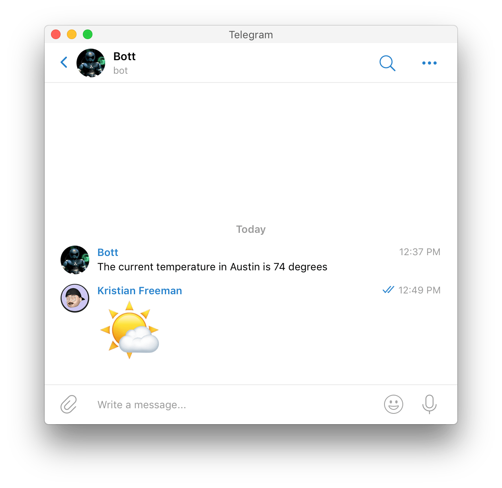
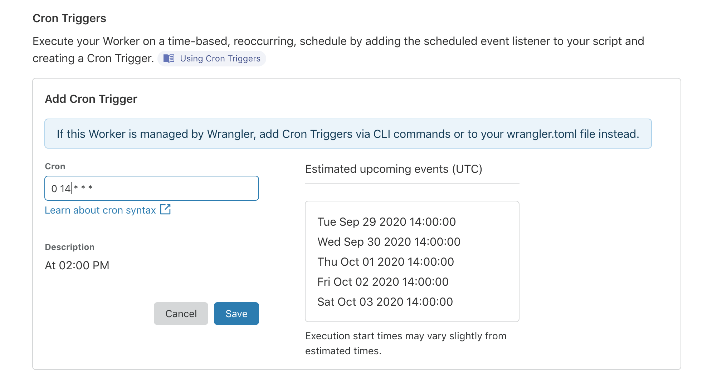

# weather-cron

Example project showcasing **Workers Cron Triggers**, by getting the weather in your area and sending it using a Telegram bot.



## Setup

1. Create a new Telegram bot ([instructions](https://core.telegram.org/bots)). You should have a unique/private token for your bot once you've created it.
2. Find your Telegram chat ID -- the easiest way to do this is to message [@get_id_bot](https://t.me/get_id_bot).
3. Get an [OpenWeatherMap](https://openweathermap.org/) access token.

## Configuration

You'll need to configure `wrangler.toml` to point to your Cloudflare account. Replace `account_id` with your Cloudflare account ID:

```toml
account_id = "123abc"
```

Before your application will correctly function, you'll need to set some configuration values using `wrangler secret put $KEY`, as seen below:

| Name      | Description                                                |
| --------- | ---------------------------------------------------------- |
| `APPID`   | OpenWeatherMap access token (sometimes called "App ID")    |
| `CHAT_ID` | Your personal chat ID (or the @username for a group chat)  |
| `CITY`    | A string representing your city (e.g. "Austin")            |
| `TOKEN`   | The token provided for authenticating as your Telegram bot |

Once you've configured your project, you can run `wrangler publish` to deploy it to Workers.

## Setting up Cron Triggers

Cron Triggers can be configured inside of the Workers dashboard, by visiting your script and going to the "Triggers" page. Cron Triggers accept cron-style strings -- if you're unsure how to write them, check out [crontab.guru](https://crontab.guru/).

Here's an example Cron Trigger that fires every day at 2pm UTC (crontabs are in UTC, so you should adjust accordingly for your timezone).


